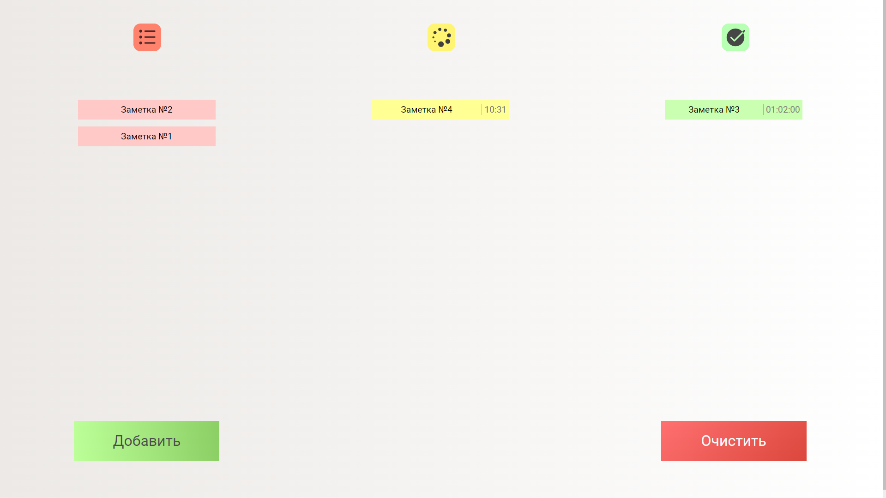
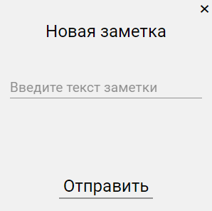
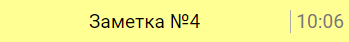
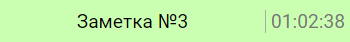
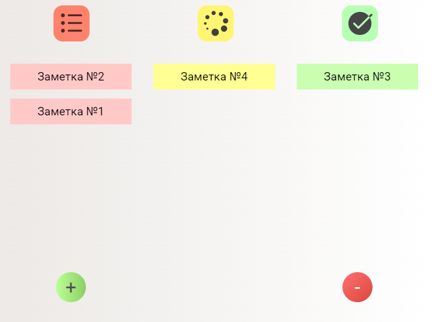
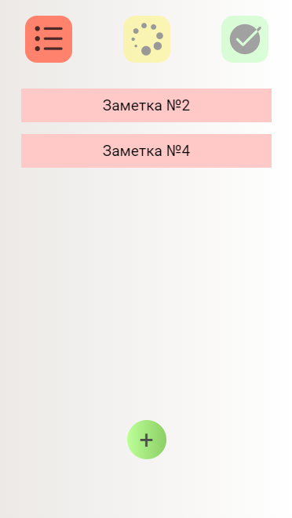

<h1 align="center">Список дел</h1>
<p align="center">
	
</p>
<h2 align="center">
	<a href="http://todo.mikhaili.infinityfreeapp.com/" target="_blank">Демо</a>
</h2>

## Описание

Сайт состоит из трёх колонок, заметки в которых отличаются по цвету. Каждая из колонок означает стадию выполнения дела: 

1. *В планах* (красный)
2. *В процессе* (жёлтый)
3. *Завершено* (зелёный)

Над каждой колонкой находится картинка, соответствующая её статусу. Под первой колонкой находится кнопка для добавления заметок. При нажатии вызывается модальное окно с соответствующим меню.



Под последней колонкой находится кнопка для удаления заметок. При нажатии удаляются заметки, находящиеся в третьей колонке, то есть очищается список завершённых дел.

## Изменение статуса заметки

Перемещение между колонками осуществлено с помощью ***drag'n'drop***, реализованного событиями mousedown, mousemove и mouseup (и их touch-аналогами). Такая реализация даёт больше гибкости, поскольку, например, появляется возможность передвигать заметку только по горизонтали, что использовано в оформлении сайта для устройств с шириной дисплея менее *600px*.

## Хранение заметкок

Заметки сохраняются в localStorage.

## Зависимость от ширины дисплея

Интрфейс имеет три заметно отличающиеся формы: для широкого, среднего и узкого экранов.

### Широкий и средний форматы

При такой ширине (*>600px*) на экране отображены сразу три колонки.

#### Перемещение заметки с помощью перестакивания по экрану

<p align="center">
	
</p>

При нажатии заметка *поднимается*, а на её месте появляется элемент, занимающий её место на время перетаскивания. 

Если в процессе перемещения заметки под курсором находится одна из колонок, снизу появляется элемент, сообщающий о возможности добавления этой заметки в колонку. 


Заметка попадёт в ту колонку, над которой была отпущена.

#### Наиболее подробный интерфейс

Для широкого дисплея (**>950px**) у заметок из второй и третьей колонки появляется дополнительная информация справа. Для второй колонки (*в процессе*) у каждой заметки появляется время начала выполнения дела, а для третьей (*завершено*) - длительность его выполнения. Длительность расчитывается от времени пребывания заметки во второй колонке.





#### Средний экран (`max-width: 950px`)

При такой ширине отсутствуют вышеуказанные подробности, а также уменьшены кнопки: изменены их наименования и ширина.



### Узкоэкранный формат (`max-width: 600px`)

На маленьких экранах будет одображаться одна колонка. Переместиться к другой колонке можно при нажатии на одну из картинок сверху.



#### Перемещение заметки с помощью *swipe*

<p align="center">
	
</p>

Чтобы заметка была перещена в другую колонку, необходимо свайпнуть её по горизонтали. Колонка будет изменена, если свайп составляет **не менее 20%** от ширины экрана. Под заметкой при её перемещении появляются картинки, сообщающие, в какую колонку попадет заметка.

## Зависимости 
Front-end сайта написан на чистом JavaScript. Для поднятия сервера использован фреймворк express.
## Установка и запуск

```bash
npm install
npm run start
```

## Лицензия
На представленных изображениях и гиф используются 
		<a target="_blank" href="https://icons8.com/icon/78975/bullet-list" rel="noreferrer">Bullet List</a>, 
		<a target="_blank" href="https://icons8.com/icon/102455/loading" rel="noreferrer">Loading</a>,
        <a target="_blank" href="https://icons8.com/icon/59757/checkmark" rel="noreferrer">Checkmark</a>,
        <a target="_blank" href="https://icons8.com/icon/fJDaWLso990w/check" rel="noreferrer">Check</a>
иконки с сайта 
		<a target="_blank" href="https://icons8.com" rel="noreferrer">Icons8</a>.